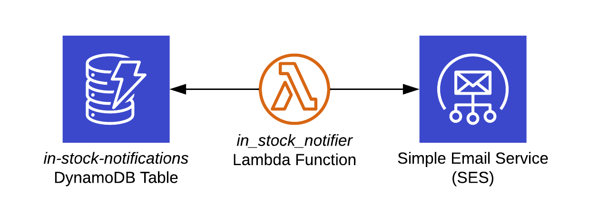

# in-stock-notifier - Get notified when a product is back in stock

Get an email notification when a product is back in stock in your online store of choice.


## Table of Contents

- [Getting Started](#getting-started)
  - [Prerequisites](#prerequisites)
  - [Basic Usage](#basic-usage)
  - [Supported Stores](#supported-stores)
  - [SES Setup](#ses-setup)
  - [Tracking New Product](#tracking-new-product)
  - [Creating New Store Interface](#creating-new-store-interface)
- [Architecture](#architecture)
- [Local Development](#local-development)
	- [Local DynamoDB](#local-dynamodb)
	- [Testing](#testing)
	- [Cleanup](#cleanup)
- [Limitations](#limitations)
- [License](#license)

## Getting Started

This project uses several AWS services ([DynamoDB](https://aws.amazon.com/dynamodb/), [Lambda](https://aws.amazon.com/lambda/), [SES](https://aws.amazon.com/ses/)), therefore you need an AWS account to use it.

AWS free tier should be sufficient for this project. Here you can review free tier conditions for [DynamoDB](https://aws.amazon.com/dynamodb/pricing/on-demand/), [https://aws.amazon.com/lambda/pricing/](https://aws.amazon.com/lambda/pricing/) and [SES](https://aws.amazon.com/ses/pricing/).

### Prerequisites

* Python 3.7 or higher
* [Pipenv](https://github.com/pypa/pipenv)
* [AWS CLI](https://aws.amazon.com/cli/)
* [AWS SAM CLI](https://docs.aws.amazon.com/serverless-application-model/latest/developerguide/serverless-sam-cli-install.html)

### Basic Usage

If the product that you want to track is from a store that is listed in [Supported Stores](#supported-stores), you will need to go through the following steps: [SES Setup](#ses-setup) and [Tracking New Product](#tracking-new-product). If the store is not supported, you will need to [create a new store interface first](#creating-new-store-interface), and then go through the above steps.

### Supported Stores

* [well.ca](https://well.ca)

### SES Setup

in-stock-notifier uses Amazon Simple Email Service ([SES](https://aws.amazon.com/ses/)) to send email notifications. To use it, you need to create a new SES template, verify your email address(es) that are used for To and From fields and confirm those email addresses. 

1. Create new SES template: `aws ses create-template --cli-input-json "$(<./misc/sns_template.json)"`
2. Verify email address(es) (used in To/From fields) `aws ses verify-email-identity --email-address $EMAIL`
3. Confirm email address(es).

You need to setup SES only once.

_If you use the same email in To and From fields, it is possible that you will see a spoofing notice or even get the notification marked as spam, depending on SPF settings of the DNS server handling emails addressed to you._

### Tracking New Product 

Create a new line in [products.csv](./in_stock_notifier/products.csv). There are only two columns per file that need to be created: first the Product Name (used in the email notification), and second the product URL.

After the product is added to the CSV, deploy the Lambda function with: `make deploy` (if you don't have `make`, just use the `sam deploy` command from the [Makefile](./Makefile)).

You need to set `EMAIL_FROM` and `EMAIL_TO` environment variables before deploying using email addresses that were verified during [SES Setup](#ses-setup). So, the final command will look like this:

```
EMAIL_FROM=your@email.address EMAIL_TO=your@email.address make deploy
```

To add another product, simply add it to [products.csv](./in_stock_notifier/products.csv) and re-deploy.

### Creating New Store Interface

The best way to create a new store interface is to first view this store's product pages from the point of view of this service.

1. Find two product pages in this online store. One with a product in stock (`in_stock_url`), another one with a product out of stock (`out_of_stock_url`).
2. Use `misc/visual_test.py in_stock_url out_of_stock_url` to save HTTP GET response HTML files in the current directory.
3. Open these files in your web browser and check if you can visually determine whether one page has the product in stock and the other doesn't. This is basically how this service "sees" web pages.
4. If you can determine that one product is in stock and the other is not by looking at these pages, then see the next step. If not, see [Limitations](#limitations). 
5. Create a new class inheriting from StoreInterface in `in_stock_notifier/store_interface.py`. In short, you need to create a `fqdn` class property and implement `_is_in_stock` method. See the file's docstrings for more details.

## Architecture



in-stock-notifier is an AWS Lambda function that functions as a cron job that gets invoked every 10 minutes. A DynamoDB table is used to track whether a notification has already been sent for a product. If the product appears to be in stock and a notification has not been already sent, SES is used to send it; then the the table is updated to reflect that.

The table gets populated only when a product appears to be in stock.

## Local Development

A local lambda function (inside a Docker container) can be used for development.

* `make invoke-dev` - invoke the local lambda function and use local instance of DynamoDB (see [Local DynamoDB](#local-dynamodb)). SES is not used but you will see in the logs if an email would have been sent.
* `make invoke-prod` - invoke the local lambda function and use the production instance of DynamoDB. SES will be used to send an actual email notification.
* `make deploy` - deploy the lambda function. The end result is identical to what you would see with `make invoke-prod` but the function will be executed by AWS, not local machine, every 10 minutes.

### Local DynamoDB

You can use a local version of DynamoDB for development. I use [dynalite](https://github.com/mhart/dynalite), but there exist [other alternatives](https://hub.docker.com/r/amazon/dynamodb-local). 

```
npm install -g dynalite
dynalite --port 8000
```

### Testing

Use `make test` to run unit tests for store interface.

It's a good idea to add two tests for each new store interface to [test_store_interface](./in_stock_interface/test_store_interface.py). One for a HTML page where a product is in stock ( and another where a product is out of stock. See examples in `in_stock_notifier/test_html`.

### Cleanup

Use `make cleanup` to remove the Cloudformation stack for this project.

## Limitations

Current implementation of StoreInterface assumes that it is possible to determine whether the product is in stock just from the HTTP GET response text of the product page. If an online store loads information about product availability dynamically (e.g. Walmart), a completely different method needs to be used. 

One option would be to use some headless browser (with [Selenium](https://selenium-python.readthedocs.io/)), but this would require changing a good chunk of the project code.


## License

in-stock-notifier is made available under the [MIT License](./LICENSE).

